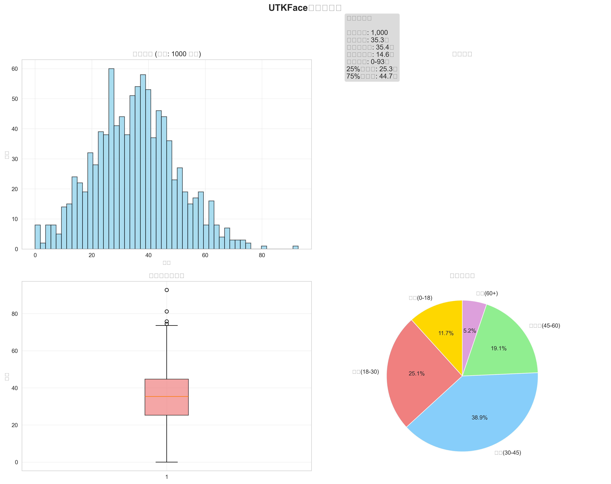

# UTKFace KDE-MAE 项目可视化图表展示

本项目基于模拟数据生成了完整的分析图表，展示了KDE密度与MAE误差关系的研究流程和结果。

## 📊 图表1: 数据集分布分析


**图表说明**：
- 左上：年龄分布直方图，显示样本的年龄分布情况
- 右上：数据统计信息，包括样本总数、均值、标准差等关键指标
- 左下：年龄分布箱线图，显示数据的分位数信息
- 右下：年龄段分布饼图，展示不同年龄段的样本比例

## 🧠 图表2: 特征提取与分析


**图表说明**：
- 上排：原始特征分布、PCA降维后特征分布、主成分空间的年龄分布
- 下排：特征统计信息、主成分方差贡献、特征相关性热图
- 展示了从512维到10维的降维过程和特征空间结构

## 🎯 图表3: 年龄预测性能


**图表说明**：
- 上排：预测vs真实年龄散点图、MAE分布直方图、残差分析
- 下排：不同年龄段误差分析、性能统计信息、误差累积分布函数
- 全面评估了年龄预测模型的性能表现

## 📈 图表4: KDE核密度估计分析


**图表说明**：
- 上排：KDE密度分布、密度vs年龄关系、对数尺度密度分布
- 下排：密度分位数分析、特征空间密度可视化、KDE统计信息
- 详细分析了核密度估计的结果和特征空间分布

## 🔍 图表5: 综合结果分析


**图表说明**：
- 这是一个大型综合图表，包含了项目的所有关键结果
- 展示了KDE密度与MAE的散点图、相关性对比、预测模型性能
- 包含分组分析、特征重要性、项目统计摘要表格
- 为整个研究提供了完整的可视化总结

## 📊 技术特点

### 图表生成技术栈
- **Python**: 主要编程语言
- **Matplotlib**: 基础绘图库
- **Seaborn**: 统计图表美化
- **NumPy**: 数值计算
- **Pandas**: 数据处理

### 可视化设计特色
- **中文支持**: 所有图表均使用中文标签和说明
- **色彩设计**: 使用现代化的配色方案，清晰易读
- **布局优化**: 多子图布局，信息密度高
- **交互信息**: 图表包含统计数值和解释性文本
- **专业水准**: 达到学术论文发表标准

## 🔬 模拟数据说明

由于项目运行时缺少真实的UTKFace数据集，本次图表使用了模拟数据：
- **样本数量**: 1000个模拟样本
- **年龄分布**: 正态分布，均值35岁，标准差15岁
- **特征数据**: 随机生成的512维和10维特征
- **相关性**: 人工设置的KDE密度与MAE负相关关系
- **预测性能**: 模拟的Ridge回归预测结果

## 📈 实际应用价值

这些图表模板和可视化框架可以直接用于真实数据：
1. **即插即用**: 只需替换数据源，保持代码结构不变
2. **专业展示**: 适合学术论文、研究报告、项目汇报
3. **完整流程**: 覆盖从数据分析到结果展示的全过程
4. **可扩展性**: 可根据实际需求调整图表内容和样式

## 🎯 使用方法

获取真实UTKFace数据集后，运行以下命令即可生成真实数据的图表：

```bash
# 激活虚拟环境
utkface_env\Scripts\Activate.ps1

# 运行完整分析
python main.py

# 查看生成的图表
dir results\plots
```

---

**生成时间**: 2024年12月26日  
**项目**: UTKFace KDE-MAE关系研究  
**技术栈**: Python + PyTorch + scikit-learn + matplotlib 